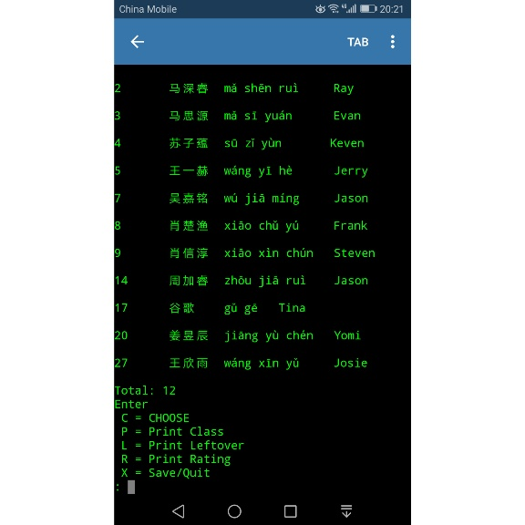
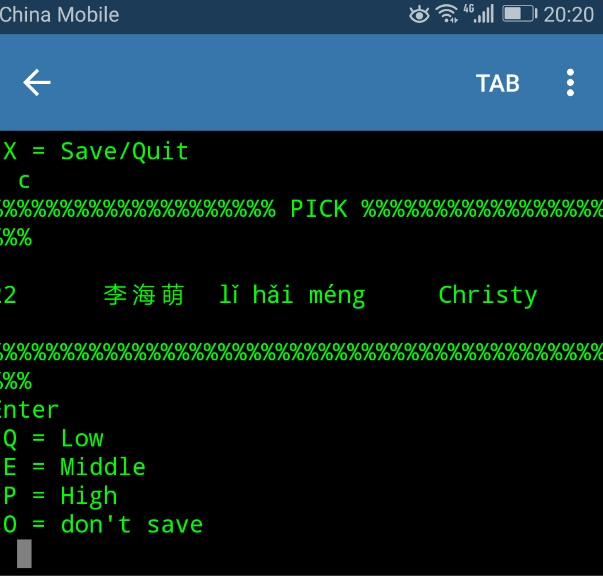

# pickerator

### a python based application 

## Pick 

Pickerator allows you to import class lists and pick students for answering questions in class.
The students who are not picked are saved in a leftover file so you can more fairly pick 
students over several class periods.

## Rate

The application also has an option to rate the students respose after picking.
The student is rated on a scale. The student's rating is saved to the class rating 
file wth a time and date stamp.

A Utf test file is the sorce for the class name.  
As this was developed in China Chinese characters and pinyin are used.

I run this application on an android python interpreter, so it can more easily be used in class

[About](https://greggelong.github.io/kreisman/)
